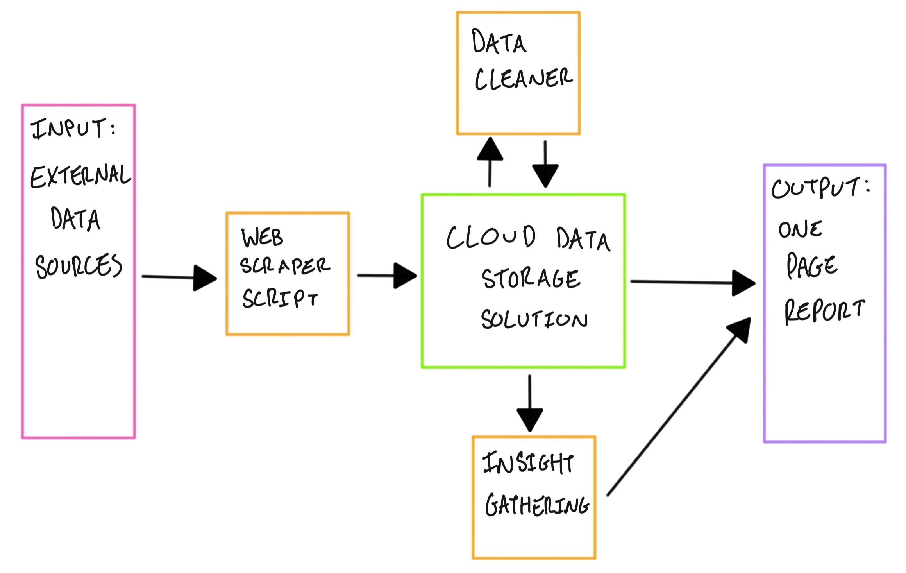
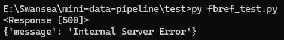
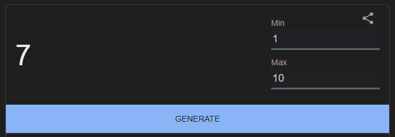

# mini-data-pipeline
A mini data pipeline to scrape, store and transform football data, then create a one page team/player overview.

## Author:
Nathan Sizer – [LinkedIn](https://www.linkedin.com/in/nathan-sizer)

## Task Outline
- Scrape basic football data from Transfermarkt and FBRef for the 2024/25 Championship season.
- Store raw data in cloud object storage.
- Transform and load it into a data warehouse/table format.
- Create a one page insight summary - player or team overview.

## Deliverables
- A short README to explain architecture, design decisions, setup instructions etc. (This file covers this).
- Python code (In this repo).
- Cloud integration.
- 1 page PDF of insight from the data.
- Notebook or report with workings for insights and visualizations.

## My Process and Decisions

### Planning
I wanted to put on (digital) paper my idea for what would be required, and the flow of data. The below image is what I came up with: (apologies for the slightly messy handwriting)\
\
Key:
- Pink: The input to the pipeline
- Purple: The project output
- Orange: Scripts
- Green: Storage
- Black Arrows: The flow of data around the pipeline

### Implementation
Firstly, I wanted to tackle the FBRef API. Unfortunately I keep receiving HTTP 500 errors (internal server error), so without knowing the ins and outs, I have written code which I believe should work when the server is capable of fulfilling the request. As a workaround to this, I have taken the example team data from the FBR API, which is for Arsenal in the 2018/19 season. I'm aware this isn't specifically what the task brief wanted, however given the apparent limitations the API was facing, having some data for the later steps of the task is better than having none at all. From this point onwards, I'm going to be taking this data and trying to pass it off as "generic team data" so that I can combine it with data scraped from Transfermarkt in order to produce the insight summary for a random team in the Championship in the 2024/25 season. E.g. this insight report will inform us about a team in the Championship after 38 games of the season has been played - it won't be factually accurate data, but I'm mainly concerned about getting my thinking and logic across here.

_**Aside**: I'm now going to decide on what team the report will be for, as we are using this "generic" data, I'm going to use a random number generator to pick a number between 1 and 24, whatever the result is, I'm going to pick the team that finished in that position in the 2024/25 championship table.\
\
As number 7 was the result, our team for this report will be Blackburn._

Now I'm going to get to work on scraping from Transfermarkt. I'm going to be using the ScraperFC Python package, [more can be found here.](https://pypi.org/project/ScraperFC/) I simply want to initially scrape details about every championship player, as we can then clean the data to get exactly what we want. Handily, the ScraperFC library handles everything for us, and returns data from Transfermarkt in a dataframe. However, the data in this dataframe still needs to be cleaned by us.

After creating separate scripts for scraping data from each of our two sources, I decided to combine them into one main (and production-ready) script, which then stores the raw data in a sub-folder, ready to be cleaned later on.

Once scraped, we can create local files of the raw data, before uploading to our cloud storage. I've chosen to use AWS, as it is a platform I have previous knowledge of, as well as being thr preferred cloud provider outlined in the job description. As an added bonus, everything I'll be doing here is available in the free tier of AWS when creating a new personal account.

Now that we can gather and store raw data, the next step is to clean and transform the data, into a more usable format. Handily, as the Transfermarkt data is already in a csv format, we can remove all players who aren't playing for Blackburn, then drop the columns which aren't necessary for our report, and then remove any rows for players who have missing data. After this, I then formatted the transfer values of the players into a numerical format, so that our report processing scripts have no issue reading these values as numbers, and we won't have to keep parsing. The data from FBRef came as a huge json file, so the approach here was to take each of the stat "groups" to be used in our report (general stats, goalkeeping, shooting, passing, defence, etc.) and convert each of these into their own dataframe (and later csv for storage) so that the analysis scripts only access what they require. Once all data has been cleaned, it can be uploaded back into the "data" folder of the S3 bucket, where all clean data lives.

From here, the next step is to integrate all of the above with an AWS EC2 instance. By running everything natively in the cloud, we can access our data whenever, and wherever we want, but also inclue scheduling and automation as we can ensure the VM instance will always be running when we need it. I decided to launch an EC2 instance running Ubuntu, as I am very familiar with this operating system, and would incur no extra cost (compared to a distribution such as Red Hat).

After cloning the git repo into the EC2 instance, I had to install the packages which are required in the project (see requirements.txt for all packages used). Once the setup was complete, I was able to run the scraper and cleaner scripts on my EC2 instance, and view the files in the S3 bucket. Proof of which is below:\
